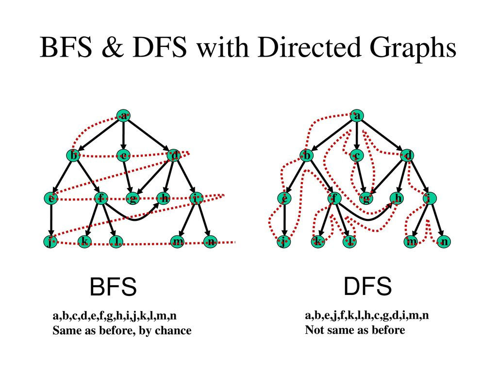

### Búsqueda en grafos

Ahora, sabemos que podemos modelar problemas con grafos y como guardarlos de forma eficiente pero no podemos hacer nada aún con ellos. Estos primeros algoritmos que veremos ahora son esenciales y se usan con demasiada frecuencia así que es importante entederlos bien.

Para estos dos algoritmos usaremos grafos guardados como listas de adyacencia. Ambos pueden ser implementados con matrices de adyacencia pero debido a la facilidad con la que podemos encontrar a los vecinos de cualquier vértice $i$ en las listas de adyacencia se prefiere este método (y en general se usa más la lista de adyacencia).

<center>  </center>

### BFS

La búsqueda por anchura o BFS (Breadth First Search en inglés) es un algoritmo de búsqueda en grafos que recorre todos los nodos del grafo de menor a mayor distancia. Se parte de la fuente $s$ (por source en inglés), se recorren todos sus vecinos, luego los vecinos de los vecinos y así hasta que no queden nodos sin visitar. Para esto usamos una cola de la siguiente manera:

```c++
// n es la cantidad de nodos y s la fuente
int n,s;
// gr es la lista de adyacencia del grafo
vector< vector<int> > gr;

// Iniciamos una lista que nos dice si hemos visitado el nodo o no
// Al principio no hemos visitado ninguno
vector<bool> visitado(n,false);

// Iniciamos la cola con la source
queue<int> bfs;
bfs.push(s);
visitado[s] = true;

// Mientras la cola no esté vacía, tenemos nodos que revisar
while (!bfs.empty()){
	// Sacamos el nodo que está en la cola
	int nodo = bfs.front();
	bfs.pop();
	
	// Revisamos sus vecinos
	for (int vecino:gr[nodo]){
		// Si no lo hemos visitado, lo visitamos agregándolo a la cola
		if (!visitado[vecino]){
			bfs.push(vecino);
			visitado[vecino] = true;
		}
	}
}
```

Con este código estamos recorriendo al grafo por "distancia" aunque esto solo considera la cantidad de aristas entre un nodo y otro, cuando las aristas tengan peso es otra historia, pero cuando no tienen peso este algoritmo de hecho es una forma perfecta de calcular la distancia de un nodo a otro, solo basta con inicializar la distancia de la source en $0$ y agregar esta linea cuando visitemos a un vecino:

```c++
distancia[vecino] = distancia[nodo] + 1;
```

### DFS

La búsqueda en profundidad o DFS (Depth First Search) es un algoritmo de búsqueda en grafos que recorre completamente una rama primero y después se devuelve a revisar las demás. La forma más fácil de implementar esto es con una función recursiva:

```c++
// La función recibe:
// El nodo que estamos visitando actualmente
// La lista de adyacencia del grafo
// La lista de nodos visitados
// Notar que los dos vectores son pasados por referencia para evitar copiarlos por cada llamada
// Para hacer esto basta con poner & antes del nombre
void dfs(int nodo, vector< vector<int> > &gr, vector<bool>& visitado){

	// Pasamos por todos los vecinos del nodo
	for (int vecino:gr[nodo]){
		// Checkeamos si no lo hemos visitado
		if (!visitado[vecino]){
			// Importante ponerlo visitado antes de llamarlo para evitar ciclos
			visitado[vecino] = true;
			// Llamamos a la función
			dfs(vecino,gr,visitado);
		}
	}
	
}

// Para llamarlo en main hay que asegurarse de poner la fuente visitada
visitado[s] = true;
dfs(s,gr,visitado);
```

Con este código recorremos cada camino lo más posible antes de continuar.

### Resolviendo un problema con búsqueda

Un grafo bipartito es un grafo que cumple que se pueden dividir todos los nodos en dos conjuntos tal que los nodos de un conjunto solo están conectados con los nodos del otro conjunto, o sea, no existe ninguna arista que conecte dos nodos del mismo conjunto.

<center>  </center>

Podemos notar que cualquier nodo que tomemos tiene que pertenecer a alguno de los dos conjuntos así que para cualquier nodo podemos revisar que todos sus vecinos sean del otro tipo, luego los vecinos de los vecinos tienen que ser del primer tipo de nuevo y así. Esto lo podemos hacer con BFS:

```c++
vector<bool> visitado(n,false);

// Iniciamos asumiendo que es bipartito
bool bipartito = true;

// Aquí guardamos el número del conjunto para cada nodo
// Como son solo dos usaremos 1 y 2
vector<int> conjunto(n);

// Pasamos por todos los nodos
for (int i=0;i<n;i++){

	// Si no hemos visitado este nodo hay que checkear su componente conexa
	// Esto no sería necesario si el grafo fuera conexo
	// En ese caso bastaría con un BFS desde un nodo cualquiera
	if (!visitado[i]){
		// Inicializamos la fuente con i
		int s = i;
		queue<int> bfs;
		bfs.push(s);
		visitado[s] = true;
		
		// Le asignamos un conjunto, este no importa porque
		// estos conjuntos se determinan de acuerdo a la
		// búsqueda, no hay otra opción realmente
		conjunto[s] = 1;
		
		// Parte el BFS
		while (!bfs.empty()){
			int nodo = bfs.front();
			bfs.pop();
			for (int vecino:gr[nodo]){
			
				// Si no ha sido visitado...
				if (!visitado[vecino]){
					bfs.push(vecino);
					visitado[vecino] = true;
					
					// Le asignamos el conjunto opuesto
					if (conjunto[nodo] == 1){
						conjunto[vecino] = 2;
					} else {
						conjunto[vecino] = 1;
					}
					
				// Si ya lo visitamos...
				} else {
					// Y tienen el mismo conjunto asignado...
					if (conjunto[nodo] == conjunto[vecino]){
						// ¡No es bipartito!
						bipartito = false;
					}
				}
			}
		}
	}
}

if (bipartito){
	cout<<"Es bipartito\n";
} else {
	cout<<"No es bipartito\n";
}

```

Ojo que este algoritmo solo funciona con un grafo no dirigido.