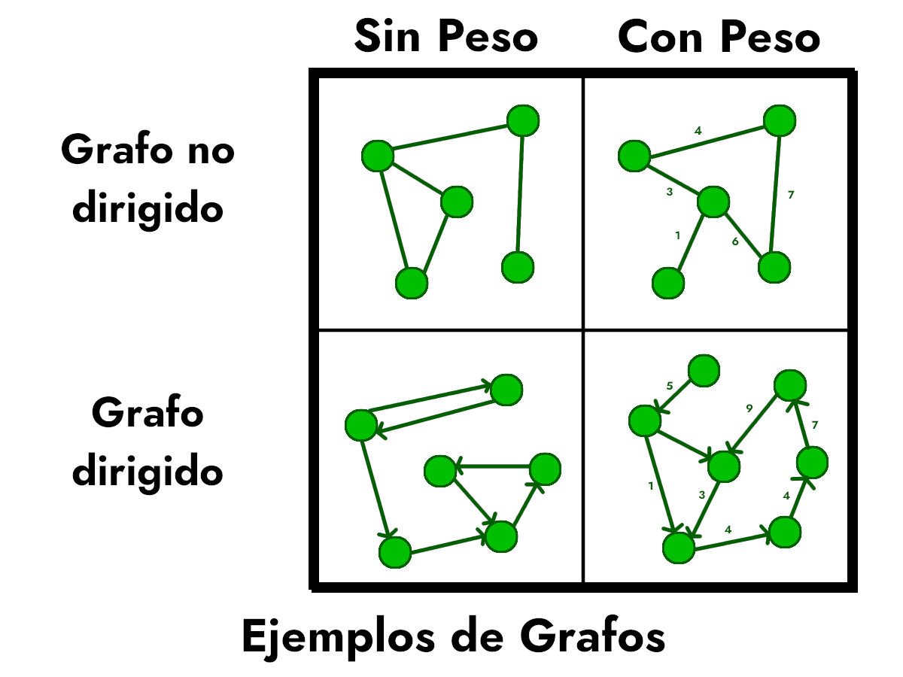

### ¿Qué son los grafos?

Los grafos son un tipo específico de estructura que nos sirve para modelar muchos problemas distintos. Estos se representan como un conjunto de elementos $V$ (llamados vértices o nodos) conectados por un conjunto de líneas $E$ (llamadas aristas o arcos). Las aristas pueden ser no-dirigidas (se pueden recorrer en ambas direcciones) o dirigidas y además pueden tener peso o no.

<center>  </center>

El área de grafos ha sido muy estudiada y se han desarrollado múltiples algoritmos para trabajar con ellos. Además, en programación competitiva es un tema que se repite con alta frecuencia.



### Conceptos básicos

Algunos conceptos básicos son:
* Camino: Es una sucesión de nodos donde cada par de nodos adyacentes están conectados por una arista.
* Ciclos: Un ciclo es un camino que comienza y termina en el mismo nodo, y que no repite nodos ni aristas entre medio.
* Componente conexa: Es un subconjunto maximal del grafo donde existe un camino entre cada par de nodos.

### Tipos de grafos

Algunos tipos básicos de grafos son:

* Grafo dirigido/no-dirigido: Un grafo no es dirigido si para cada arista $(u,v)$ también existe su simétrica $(v,u)$.
* Grafo conexo/conectado: Un grafo conexo es un grafo no dirigido donde existe un camino entre todo par de nodos, es decir, tiene solo una componente conexa.
* Árbol: Un árbol es un grafo no dirigido que es conexo y no tiene ciclos. Se puede demostrar que si tiene $n$ nodos, entonces forzosamente tiene $n-1$ aristas.

### Representaciones de un grafo

Un grafo es un concepto más abstracto que otras estructuras. Hay dos formas principales de representarlos en un programa:

#### Lista de adyacencia
Una lista de adyacencia consiste en, para cada nodo, guardar una lista de sus vecinos. Para esto usamos un vector de vectores en donde el $i$-ésimo vector contiene a los nodos a los que el nodo $i$ está conectado (es decir, los nodos $j$ tal que existe la arista $(i,j)$). Si las aristas tienen peso se puede usar un vector de pares para cada nodo donde se guarda el nodo al que está conectado y el peso. Esto usa $O(n+m)$ de memoria.

```c++
// Asumiendo que n es la cantidad de nodos
vector <vector<int>> gr(n);
// Vamos a leer m aristas y agregarlas al grafo
for(int i=0; i<m; i++){
	int u, v;
	cin >> u >> v;
	// Agregamos v a la lista de conexiones de u...
	gr[u].push_back(v);
	// y agregamos u a la lista de v
	gr[v].push_back(u);
	// si el grafo no es bidireccional basta con quitar esta última línea
}
```

#### Matriz de adyacencia
Aquí tendremos una matriz donde la fila y la columna nos indican de qué par de nodos estamos hablando y el valor nos dirá si están conectados o no. Para esto usamos un vector de vectores $G$ de tamaño $n \times n$ y el valor $G_{i,j}$ será $1$ si los nodos $i$ y $j$ están conectados y $0$ si no. Si tenemos aristas con peso, basta con guardar el peso en las posiciones $G_{i,j}$ y algún valor específico en otro caso (asegurarse de que este valor no pueda ser un peso para que no se confunda con uno). En espacio, esto ocupa $O(n^2)$.

```c++
// Todos parten desconectados
vector <vector<int>> gr(n, vector<int>(n,0));

for(int i=0; i<m; i++){
	cin >> u >> v;
	gr[u][v] = 1;
	gr[v][u] = 1;
}
```

La matriz de adyacencia tiene la ventaja de que se puede consultar la existencia de una arista $(u, v)$ en $O(1)$, pero usa más memoria que la lista de adyacencia, porque en la lista de adyacencia solo guardamos un entero por cada arista que existe en el grafo, mientras que en la matriz guardamos un entero (o booleano 0/1) para cada arista independiente de si existe o no. Por esto, rara vez se usa para resolver un problema.



### Resolviendo un problema de grafos

Un problema simple que podemos resolver es encontrar el nodo con el grado máximo en un grafo, el grado es la cantidad de aristas que salen de un nodo y encontrar esto en una lista de adyacencia es fácil ya que solo es el tamaño de su vector:

```c++
// Partimos diciendo que el nodo 0 es la respuesta
int ans = 0;

// Iteramos por todos los nodos
for (int i=1; i<n; i++) {
	// Si el nodo tiene un grado mayor que la respuesta actual,
	// actualizamos la respuesta
	if(gr[i].size() > gr[ans].size()){  
		ans = i;
	}
}
```

Si tenemos el grafo guardado como una matriz de adyacencia es un poco más difícil:

```c++
// Partimos sin respuesta ya que todavía tenemos que calcular el grado
int ans=-1, grado_ans=-1;

// Pasamos por todos los nodos
for(int i=0; i<n; i++){
	
	// Calculamos el grado contando cuantos 1 hay en la fila
	int grado_i = 0;
	for(int j=0; j<n; j++){
		if(gr[i][j]) grado_i++;
	}
	
	// Y hacemos el mismo checkeo que antes
	if(grado_i > grado_ans){
		ans = i;
		grado_ans = grado_i;
	}
}
```

