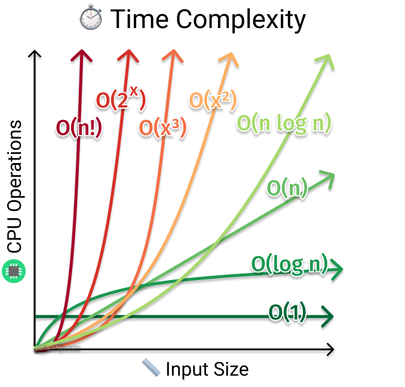

## Complejidad computacional

La complejidad computacional nos permite analizar qué tan eficiente es un algoritmo, ya sea en espacio o tiempo de ejecución. Saber analizar la complejidad de los algoritmos que escribimos es **vital** en programación competitiva porque nos permite predecir si una solución corre bajo el tiempo límite antes de programarla.

No analizar la complejidad de una solución antes de programarla es un error, ya que es posible que ésta no sea lo suficientemente eficiente y perderemos tiempo valioso programando algo que dará Time Limit Exceeded (TLE).

En programación competitiva el análisis suele hacerse sobre el tiempo de ejecución y no sobre la memoria. Esto se debe a que los límites de memoria suelen ser más generosos y además la memoria está muy relacionada con el tiempo: crear $O(n)$ variables toma $O(n)$ tiempo. Por esto, casi siempre hablaremos de **tiempo de ejecución**, o simplemente **tiempo**.

## La O grande



La notación de O grande es por lejos la más usada en programación competitiva, ya que establece una **cota superior** para la cantidad de operaciones que nuestro algoritmo realiza. Nos interesa esta cota superior ya que los jueces y casos de prueba están diseñados para siempre poner a prueba nuestro código con el **peor caso posible**.

Existe una definición rigurosa con límites, pero para nuestro objetivo basta con entenderlo intuitivamente:



Con asintótico nos referimos, dicho de manera informal, a cuando $n$ es muy grande. En la práctica esto significa que $O(n^2 + n)$ es lo mismo que $O(n^2)$, dado que el término $n$ es despreciable al lado de $n^2$ cuando $n$ es muy grande. En programación competitiva trabajamos con números muy grandes, así que en la práctica esto es útil y simplifica el análisis: al final solo nos interesa el término dominante en la función. De la misma forma, las constantes que acompañan la función son despreciables: $O(3n^3 + 5n^2 + 5)$ es simplemente $O(n^3)$.

## ¿Operaciones?

El análisis de complejidad toma alguna unidad primitiva para calcular la función $f(n)$ en $O(f(n))$. Podríamos hilar fino y expresar esto en función de la cantidad de bits que operamos o en ciclos del reloj de la CPU, pero en programación competitiva esto resulta innecesario y es suficiente con expresar la complejidad en función del tamaño de la entrada del problema que estamos resolviendo.

Diremos que las siguientes operaciones toman _tiempo constante_ $O(1)$:
* Operaciones aritméticas, de bits y comparaciones: Esto incluye sumar, restar, dividir, multiplicar, el operador módulo, los operadores de bits y las comparaciones `(<, >, <=, >=, ==)`. Aunque en la práctica dividir toma muchos más ciclos de reloj en la CPU que sumar, para nosotros esa diferencia será despreciable.
* Acceder y modificar memoria: Esto incluye leer una posición de un vector, declarar o asignar una variable primitiva.
* Otros: llamar una función, retornar un valor, leer o imprimir una variable a la consola y _castear_ un tipo.

En teoría cualquier operación que no dependa del tamaño de la entrada de nuestro problema será $O(1)$. Cuando el tiempo límite de un problema está muy apretado puede ser útil saber cuáles de ellas son más lentas o más rápidas, pero la primera prioridad al proponer una solución es siempre el análisis asintótico.

## Ejemplos

Los siguientes ejemplos sirven para que practiques el análisis de complejidad. Recomendamos que intentes analizarla antes de ver la solución.

### Suma de un arreglo

```c++
int n;
cin >> n;
vector <int> arr(n);
for(int i=0; i<n; i++){
    cin >> arr[i];
}
int suma = 0;
for(int i=0; i<n; i++){
    suma += arr[i];
}
cout << suma << endl;
```
{}
El código lee un $n$ seguido de una lista de $n$ números. Luego calcula e imprime la suma de todos los números de esa lista.

Las líneas donde se declara $n$, suma, se lee $n$ y se imprime suma toman tiempo constante $O(1)$ así que no afectan nuestro resultado.

La declaración de arr toma $O(n)$ porque se declara con tamaño inicial $n$. El primer ciclo for realiza la operación cin $n$ veces. Cada una es $O(1)$ pero al hacerse $n$ veces el for toma tiempo total $O(n)$. Nota que el for tiene otras operaciones $O(1)$ como inicializar $i$ en cero, comparar $i<n$ en cada iteración, incrementar $i$ en 1 en cada iteración o acceder y modificar la posición $i$-ésima del arreglo.

De forma similar, segundo for realiza $n$ sumas así que también toma tiempo $O(n)$. Así, la complejidad de este algoritmo es $O(n)$.
{}

### For anidado

```c++
int n, m;
cin >> n >> m;
int res = 0;
for(int i=0; i<n; i++){
    for(int j=0; j<m; j++){
        res += i*j;
    }
}
cout << res << endl;
```
{}
Aquí tenemos un típico for dentro de otro. Ya sabemos que declarar variables, sumar, multiplicar y asignar es $O(1)$ así que nos saltaremos ese análisis.

El primer for realiza $n$ iteraciones, mientras que el segundo realiza $m$ iteraciones con operaciones que toman tiempo constante. Para cada iteración del primer for se realizarán $m$ iteraciones del segundo, así que en total esas operaciones se ejecutarán $n \cdot m$ veces. Así, la complejidad es $O(nm)$.
{}

### Par o imprimir
```c++
int w;
cin >> w;
if(w%2 == 0){
    cout << "Es par" << endl;
}
else{
    for(int i=0; i<w; i++){
        cout << i << endl;
    }
}
```
{}
Este código tiene dos ramas posibles. Si $w$ es par, solo imprime que es par, mientras que si es impar imprime todos los números de $0$ a $w-1$.

Aunque la primera rama del if sea $O(1)$ (evaluar la condición e imprimir toman tiempo constante), la segunda rama toma tiempo $O(w)$ pues realiza $w$ operaciones. Como nos interesa analizar el peor caso diremos que este algoritmo es $O(w)$.
{}

### Exponenciación
```c++
int n;
cin >> n;
for(int i=0; i<n; i++){
    int j = 1;
    while(j<n){
        j *= 2;
    }
}
```
{}
Leemos un $n$ y el primer for itera $n$ veces. Notemos que la cantidad de veces que se repite el _while_ es igual a la cantidad de veces que hay que multiplicar por dos para llegar a $n$, lo que equivale a $\log_2(n)$. Así, como cada iteración del primer for realiza $O(\log n)$ operaciones, la complejidad resulta $O(n \log n)$.
{}

### Índices
```c++
int n;
cin >> n;
vector <int> arr(n);
vector <vector <int>> indices(n);
for(int i=0; i<n; i++){
    // en este problema leemos n números que están entre 0 y n-1.
    // Es decir, nos garantizan 0 <= arr[i] < n.
    cin >> arr[i];
    indices[arr[i]].push_back(i);
}

for(int x=0; x<n; x++){
    int suma = 0;
    for(int j=0; j<indices[x].size(); j++){
        suma += indices[x][j];
    }
    cout << suma << endl;
}
```
{}
En este código tenemos un vector de vectores `indices` donde `indices[x]` tiene un vector con todas las posiciones donde aparece `x` en el arreglo original. Hasta el primer for la complejidad es $O(n)$.

El segundo for es interesante: para cada $x$ entre $0$ y $n-1$ sumamos los índices en los que aparece $x$ en el arreglo original. El for de afuera se repite $n$ veces. Es fácil equivocarse y pensar que la complejidad será $O(n^2)$, porque `indices[x]` puede tener $n$ elementos en el peor caso, por lo que en una iteración del for de afuera el for de adentro se repetiría $n$ veces, pero hay una observación crucial: la cantidad de índices que guardamos en `indices` es en total $n$ a través de todos los `x` posibles. El for de adentro itera exactamente una vez por cada índice que guardamos antes, así que en total iterará $n$ veces, por lo que la complejidad final del algoritmo es $O(n)$.
{}

### Serie harmónica
```c++
int n;
cin >> n;
int ans = 0;
for (int i = 1; i < n; i++) {
  for (int j = 1; j < n; j += i) {
    ans += i*j;
  }
}
```
{}
Este tipo de patrones son muy comunes en la programación competitiva. Por ejemplo, en algoritmos como la criba, y el análisis es útil en otros casos como lo es quicksort.

Notar que en la $i$-ésima iteración se realizan $\frac{n}{i}$ operaciones, por lo tanto, la cantidad de operaciones en total son:

$$\sum_{i=1}^n \frac{n}{i} = n \sum_{i=1}^n \frac{1}{i}$$

Esta última sumatoria es la serie harmónica $H_n$ entonces:

$$n \sum_{i=1}^n \frac{1}{i} = n H_n$$

Sabemos que $H_n$ tiene comportamiento $O(\log n)$ por lo que podemos concluir que el algoritmo es del orden de $O(n \log n)$.
{}

## ¿Cómo se si mi solución pasa en tiempo?

Hay una regla de oro que sirve para estimar el tiempo de ejecución:



Como los tiempos límite suelen ser de alrededor de un segundo, esto significa que queremos realizar a lo más $10^8$ operaciones. Esto significa que si $n <= 10^4$, una solución $O(n^2)$ pasa _justo_ en tiempo, pues $(10^4)^2 = 10^8$, mientras que una $O(n^3)$ dará TLE.

A continuación mostramos complejidades comunes que pasan en tiempo para varios tamaños posibles de entrada:

| Tamaño del input (n) | Peor complejidad aceptada     |
| -------------------- | ----------------------------- |
| <= [10..11]          | $O(n!), O(n^6)$               |
| <= [15..18]          | $O(n^2 \cdot 2^n)$            |
| <= [18..22]          | $O(n \cdot 2^n)$              |
| <= 100               | $O(n^4)$                      |
| <= 500               | $O(n^3)$                      |
| <= 2000              | $O(n^2 \log n)$               |
| <= 10^4              | $O(n^2)$                      |
| <= 10^5              | $O(n \sqrt n), O(n \log^2 n)$ |
| <= 10^6              | $O(n \log n)$                 |
| <= 10^8              | $O(n), O(\log n), O(1)$       |



## Problemas para ejercitar

Es difícil encontrar problemas para ejercitar el análisis de complejidad, ya que se usa en todos los problemas. Estos problemas requieren un análisis de complejidad novedoso o más complicado de lo usual.

* [Weird Algorithm - CSES](https://cses.fi/problemset/task/1068)
* [Fun - Codeforces](https://codeforces.com/contest/1996/problem/D)
* [Meet in the Middle - CSES](https://cses.fi/problemset/task/1628)
